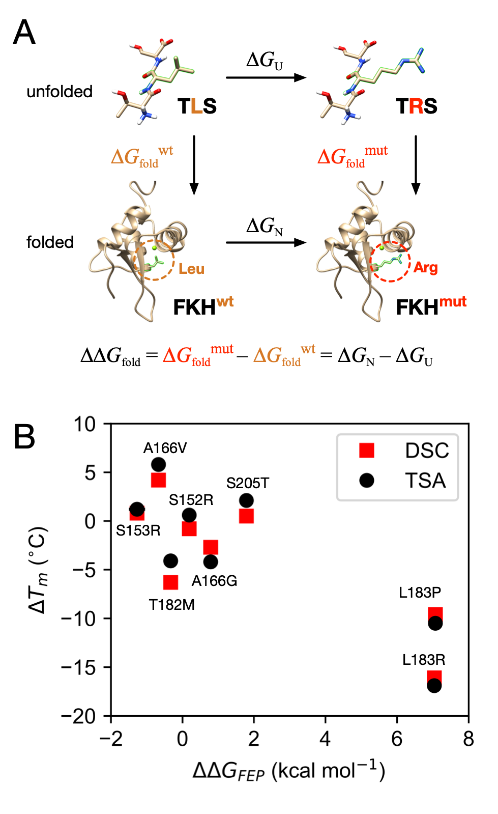
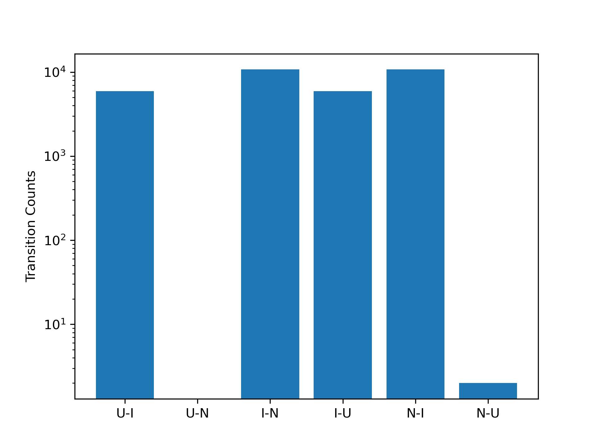

# Oncogenic mutations in the DNA-binding domain of FOXO1 disrupt folding: quantitative insights from experiments and molecular simulations
### This Repo contains all the scripts to reproduce figures from the manuscript in companion with the [OSF](https://osf.io/t7h5b/) dataset for the following files;
- distances_tica2.5_output.npy
- distances_cluster_1000_4_centers.npy
- distances_cluster_1000_4_dtrajs.npy
- distances_msm_10_100
- cktest.h5

## Table of Contents
### [Figure 3](./Figure_3): FEP v. Tm

  

### [Figure 4](./Figure_4): FES,ITS,Eigenvectors

  

### [Figure 5](./Figure_5): Secondary Structure map & Contact map.

  

### [Figure 6](./Figure_6): SASA Comparison of states and FEP tripeptide model for mutant residues.

  

### [Figure 7](./Figure_7): Comaprison of HT model, alchem. FEP, & FOLDX.

  

### [tm2ddG](./tm2ddG): Convert tm to ddG.

  

### [HT Model](./HT_model) : Calculate ddG using HT model.

  

### [Figure S1](./DSCvTSA): Tm for DSC and TSA.

  

### [Figure S3](./Figure_S3): State Transition Counts.

  

### [Figure S6](./Figure_S6): Forward and Backwards Convergence of FEP.

  

### [Figure S7](./Figure_S7): Overlap Matrix for FEP.

  

