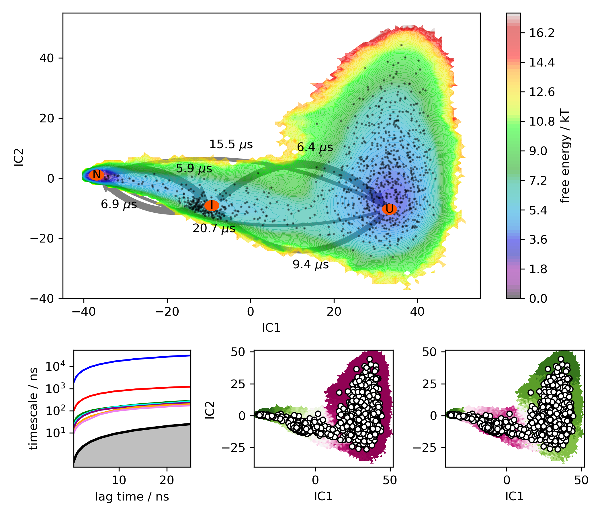
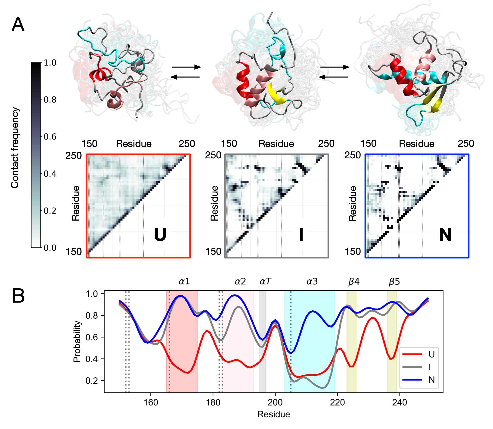
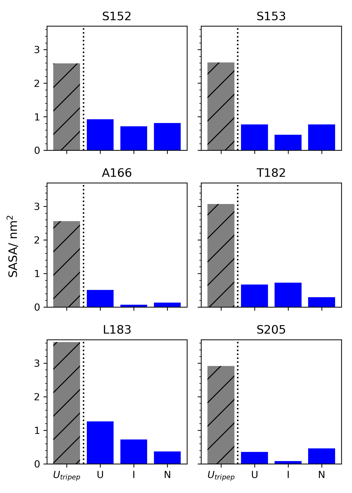
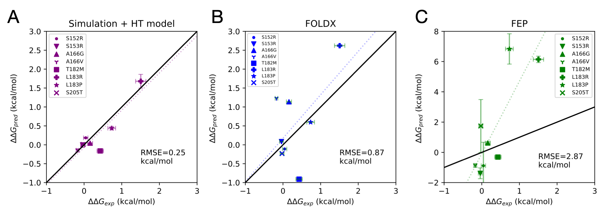
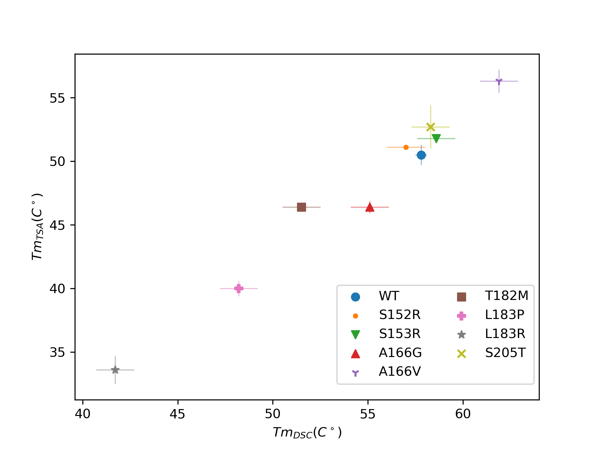
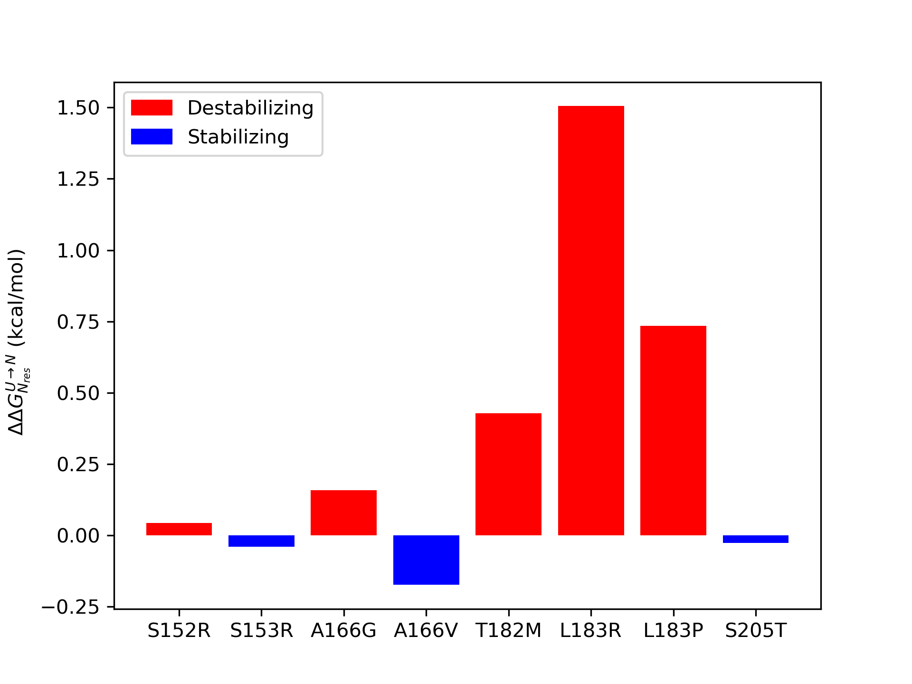
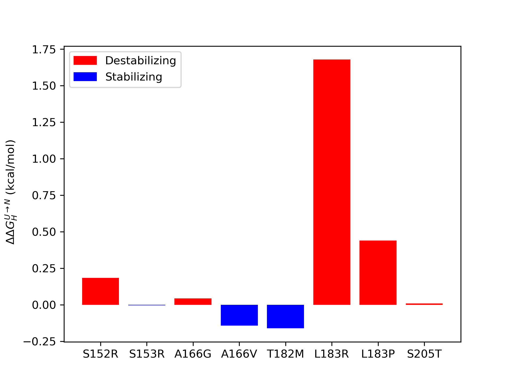

# Oncogenic mutations in the DNA-binding domain of FOXO1 disrupt folding: quantitative insights from experiments and molecular simulations
### This Repo contains all the scripts to reproduce figures from the manuscript in companion with the dataset found at XXXX[URL HERE] for files larger than allowable on Github

## Table of Contents
### [Figure 4](./Figure_4): FES,ITS,Eigenvectors

  

### [Figure 5](./Figure_5): Secondary Structure map & Contact map.

  

### [Figure 6](./Figure_6): SASA Comparison of states and FEP tripeptide model for mutant residues.

  

### [Figure 7](./Figure_7): Comaprison of HT model, alchem. FEP, & FOLDX.

  

### [Figure S1](./DSCvTSA): Comaprison of HT model, alchem. FEP, & FOLDX.

  

### [tm2ddG](./tm2ddG): Convert tm to ddG.

  

### [HT Model](./HT_model) : Calculate ddG using HT model.

  

